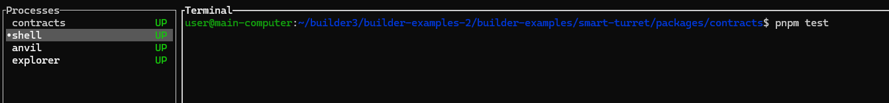
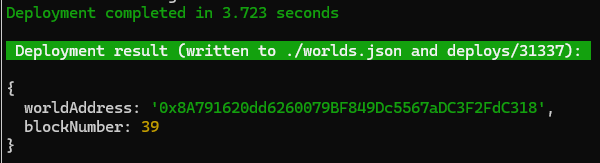

# Smart Gate Example

## Introduction
This guide will walk you through the process of building contracts for a Smart Gate, deploying them into an existing world running, and testing their functionality by executing scripts.

Smart Gates allow players to create player-made transport gates, connecting systems and regions. It also features configuration options to allow specific players to use it. 

This example shows how to create a Smart Gate which only allows members of a specific corporation access.

You can use [Deployment and Testing in Local](#Local) to test the example on your computer and [Deployment to Nebula / Nova](#Nebula) to deploy it to the game.

### Additional Information

For additional information on the Smart Gate you can visit: [https://docs.evefrontier.com/SmartAssemblies/SmartGate](https://docs.evefrontier.com/SmartAssemblies/SmartGate).

## Deployment and Testing in Local<a id='Local'></a>
### Step 0: Deploy the example contracts to the existing world
First, copy the World Contract Address from the Docker logs obtained in the previous step, then run the following commands:


Move to the example directory with:

```bash
cd smart-gate
```

Then install the Solidity dependencies for the contracts:
```bash
pnpm install
```

This will deploy the contracts to a forked version of your local world for testing.
```bash
pnpm dev
```

### Step 1: Mock Data
To create the mock data, you can click on the shell process as seen in the image below, click in the terminal and then run:

```bash
pnpm mock-data
```



### Step 2: Configure Smart Gates
Next, link the smart gates using:

```bash
pnpm configure-smart-gates
```

Then link them using:
```bash
pnpm link-gates
```

### Step 3: Testing (Optional)
You can check if it works by using the can-jump script with:

```bash
pnpm can-jump
```

## Deployment to Nebula / Nova<a id='Nebula'></a>
### Step 0: Deploy the example contracts to Nova or Nebula
Move to the example directory with:

```bash
cd smart-gate/packages/contracts
```

Then install the Solidity dependencies for the contracts:
```bash
pnpm install
```

Next, setup the local environment variables for Nebula using:

```bash
pnpm env-nebula
```

Or for Nova:
```bash
pnpm env-nova
```

Then deploy the contracts using:

```bash
pnpm run deploy:garnet
```



### Step 1: Setup the environment variables 
Next, replace the following values in the [.env](./packages/contracts/.env) file with the respective values.

For Nova and Nebula, Get your recovery phrase from the game wallet, import into EVE Wallet and then grab the private key from there.

```bash
PRIVATE_KEY=0xac0974bec39a17e36ba4a6b4d238ff944bacb478cbed5efcae784d7bf4f2ff80
```

For Nova or Nebula, the smart gate id is available once you have deployed an Smart Gate in the game. Right click your Smart Gate, click Interact and open the dapp window and copy the smart gate id.

You can retrieve the Corp ID from:
1. Retrieve your public address from searching your username here: [Smart Characters World API](https://blockchain-gateway-nebula.nursery.reitnorf.com/smartcharacters)
2. Use this link: https://blockchain-gateway-nebula.nursery.reitnorf.com/smartcharacters/ADDRESS and replace "ADDRESS" with the address from the previous step.
3. Use the "corpId" value which should be in:
```json
{
    "address": "0x9dcd62f5c02e7066a3154bc3ba029e85345a5ce9",
    "id": "27968150122480120904130498262405934486185445355744041492535994892832439518842",
    "corpId": "98000002",
    "name": "CCP Red Dragon",
    ...
```

Then set the below values:

```bash
# Copy this info from in game smart gate
SOURCE_GATE_ID=34818344039668088032259299209624217066809194721387714788472158182502870248994

# Copy this info from in game smart gate
DESTINATION_GATE_ID=67387866010353549996346280963079126762450299713900890730943797543376801696007

# Copy this information from your Smart Character corp ID
ALLOWED_CORP_ID=3434306
```

### Step 2: Configure Smart Gate
To configure which smart gates will be used, run:

```bash
pnpm configure-smart-gates
```

You can alter the gate ID's and the allowed corp in the .env file as needed.

### Troubleshooting

If you encounter any issues, refer to the troubleshooting tips below:

1. **World Address Mismatch**: Double-check that the `WORLD_ADDRESS` is correctly updated in the `contracts/.env` file. Make sure you are deploying contracts to the correct world.
   
2. **Anvil Instance Conflicts**: Ensure there is only one running instance of Anvil. The active instance should be initiated via the `docker compose up -d` command. Multiple instances of Anvil may cause unexpected behavior or deployment errors.

3. **Not able to jump even though it's the correct corp**: Ensure you have set the correct corp ID set in the `contracts/.env` file.  

### Still having issues?
If you are still having issues, then visit [the documentation website](https://docs.evefrontier.com/Troubleshooting) for more general troubleshooting tips.