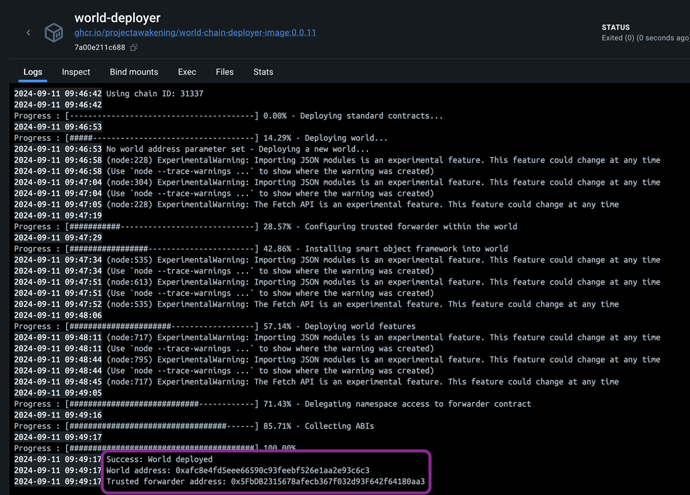
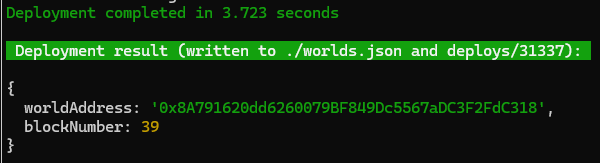
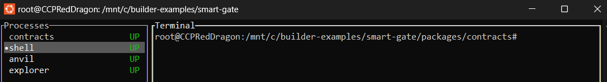
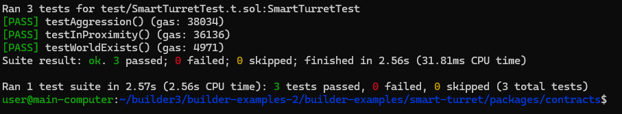

# Smart Turret Example

## Introduction
This guide will walk you through the process of building contracts for the smart turret, deploying them into an existing world running in Docker, and testing their functionality by executing scripts.

This example shows how to interact with the Smart Turret smart assembly and how to create contracts for it. The Smart Turret allows you to defend an area and can be configured to determine which ships to shoot and the priority to shoot them.

You can use [Deployment and Testing in Local](#Local) to test the example on your computer and [Deployment to Stillness / Nova](#Stillness) to deploy it to the game.

### Additional Information

For additional information on the Smart Storage Unit you can visit: [https://docs.evefrontier.com/SmartAssemblies/SmartTurret](https://docs.evefrontier.com/SmartAssemblies/SmartTurret)

## Deployment and Testing in Local<a id='Local'></a>
### Step 0: Deploy the example contracts to the existing world
First, copy the World Contract Address from the Docker logs obtained in the previous step, then run the following commands:



Move to the example directory with:

```bash
cd smart-turret
```

Then install the Solidity dependencies for the contracts:
```bash
pnpm install
```

This will deploy the contracts to a forked version of your local world for testing.
```bash
pnpm dev
```

Once the contracts have been deployed you should see the below message. When changing the contracts it will automatically re-deploy them.



### Step 1: Tests for the existing world **(Local Development Only)**
To run tests to make sure that the Smart Turret example is working, you can click on the shell process as seen in the image below, click in the terminal and then run:

```bash
pnpm test
```


You should then see the tests pass:




## Deployment to Stillness / Nova<a id='Stillness'></a>
### Step 0: Setup development environment
Move to the example directory with:

```bash
cd smart-turret/packages/contracts
```

Then install the Solidity dependencies for the contracts:
```bash
pnpm install
```

### Step 1: Setup namespace
Next, set the namespace for your smart contracts. This will be the namespace that you use for future development of this or other projects. 

For example, you could use your username as the namespace. Once you deploy to a namespace, it will set you as the owner and only you will be able to deploy smart contracts within the namespace. 

Namespaces can only contain a-z, A-Z, 0-9 and _. Set the namespace using:

```bash
pnpm set-namespace
```

### Step 2: Deploy the example contracts to Stillness or Nova
Now, convert the [.env](./packages/contracts/.env) **WORLD_ADDRESS** value to either Stillness or Nova using the following command for Stillness:

```bash
pnpm env-stillness
```

Or for Nova:
```bash
pnpm env-nova
```

Now replace the private key in the [.env](./packages/contracts/.env) file. Get your recovery phrase from the game wallet, import into EVE Wallet and then grab the private key from there.

```bash
PRIVATE_KEY=0xac0974bec39a17e36ba4a6b4d238ff944bacb478cbed5efcae784d7bf4f2ff80
```

Then deploy the contract using:

```bash
pnpm run deploy:garnet
```

Once the deployment is successful, you'll see a screen similar to the one below. This process deploys the Smart Turret contract. 


### Step 3: Setup the environment variables 
Next, replace the following values in the [.env](./packages/contracts/.env) file with the below steps.

For Stillness or Nova, the smart turret id is available once you have deployed an Smart Turret in the game. Right click your Smart Turret, click Interact and open the dapp window and copy the smart turret id.

```bash
#SMART TURRET ID
SMART_TURRET_ID=
```

### Step 4: Configure Smart Turret
To configure which Smart Turret the contract uses, run:

```bash
pnpm configure-smart-turret
```

You can alter the smart turret ID in the .env file as needed.

### Troubleshooting

If you encounter any issues, refer to the troubleshooting tips below:

1. **World Address Mismatch**: Double-check that the `WORLD_ADDRESS` is correctly updated in the `contracts/.env` file. Make sure you are deploying contracts to the correct world.
   
2. **Anvil Instance Conflicts**: Ensure there is only one running instance of Anvil. The active instance should be initiated via the `docker compose up -d` command. Multiple instances of Anvil may cause unexpected behavior or deployment errors.

3. **Turret ID Mismatch (Devnet)**: Double-check that the `SMART_TURRET_ID` is correctly updated in the `contracts/.env` file. 

### Still having issues?
If you are still having issues, then visit [the documentation website](https://docs.evefrontier.com/Troubleshooting) for more general troubleshooting tips.